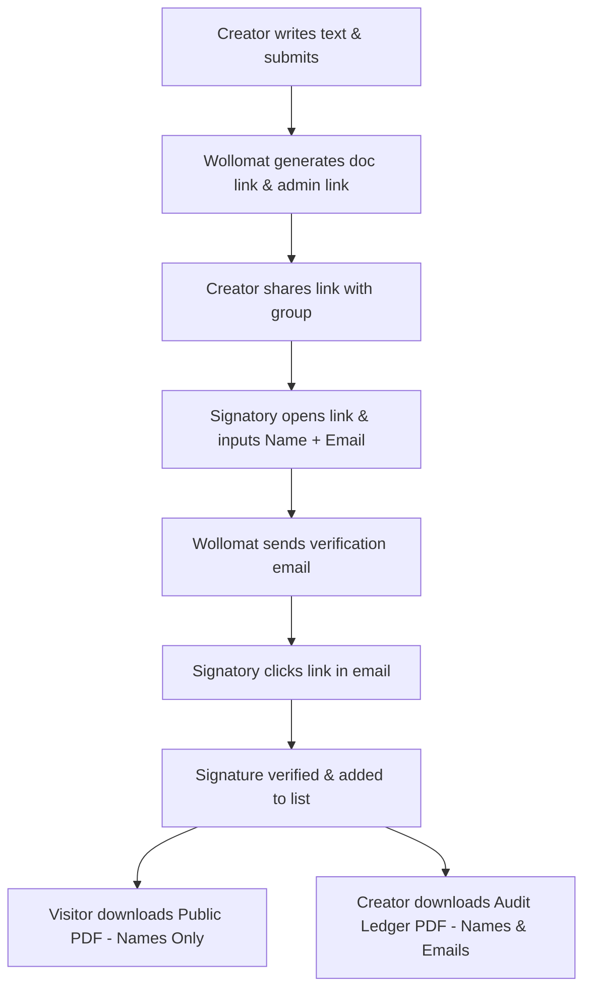
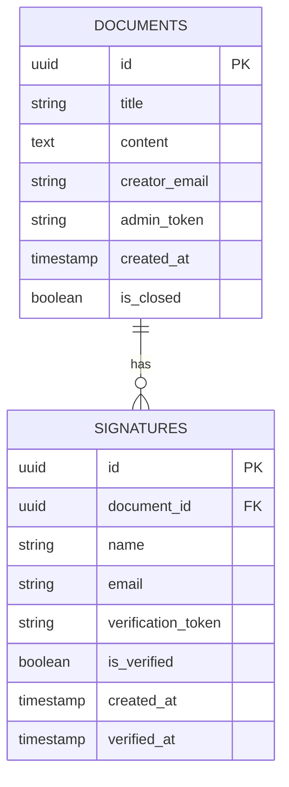

# Product Requirements Document (PRD): Wollomat

## 1. Executive Summary

**Wollomat** is a simple, lightweight web application designed for small, closed groups (co-workers, flatmates, local clubs, neighborhood committees) to collectively sign a text (e.g., an open letter, a collective complaint, a greeting card, or an internal petition). 

Unlike public petition platforms that focus on virality and massive numbers, Wollomat is built for trust, speed, and simplicity. It allows a creator to publish a text, share a private link, and collect verified signatures without requiring users to create accounts. Signatures are verified using a single-use email confirmation link. Once signatures are collected, the final document with its signature log can be downloaded with a secure timestamp.

---

## 2. User Roles & Permissions

| Role | Permissions & Capabilities |
| :--- | :--- |
| **Document Creator** | <ul><li>Creates a document by entering a title and the main text.</li><li>Inputs their email to receive a management link.</li><li>Can close signing or delete the document via the management link.</li><li>Can download both the Public PDF and the detailed Audit Ledger PDF (with emails).</li></ul> |
| **Signatory (Signee)** | <ul><li>Views a document via a shared link.</li><li>Enters their Name and Email to initiate signing.</li><li>Confirms their signature via a link sent to their email.</li></ul> |
| **Visitor / Observer** | <ul><li>Views the document and the public list of current signatures (names only).</li><li>Can download the Public PDF (names only).</li></ul> |

---

## 3. Product Features & User Flows

### 3.1. Document Creation Flow
- **Fields**:
  - `Title` (required, max 100 characters)
  - `Document Text` (required, markdown supported, max 10,000 characters)
  - `Creator Email` (required, not publicly visible, used only for admin links)
- **Output**:
  - A unique, obfuscated shareable link (e.g., `/d/3a8f9c2b-e7b1-...`)
  - A unique admin link sent to the creator's email (e.g., `/d/3a8f9c2b-e7b1-.../admin?token=...`)

### 3.2. Document Viewing & Signing Flow
- **Page Layout**:
  - Beautiful, readable document view (large typography, optimized line height).
  - Clear signature container displaying the current count and names of verified signees.
  - Floating/sticky "Sign this Document" button leading to a simple form.
- **Signing Form**:
  - Fields: `Full Name` and `Email Address`.
  - A clear disclosure: *"Your email is only used to verify your signature and will be visible to the document creator for audit purposes. It will never be displayed publicly."*
  - On submit: Displays an elegant "Check your inbox" screen.
- **Email Verification**:
  - Signatory receives a clean transaction email: 
    > *"Please click here to confirm your signature on '\[Document Title\]'."*
  - Clicking the link redirects the user to the document page with a success toast showing their signature is now live.

### 3.3. Document Export & Timestamping
- **Public Export**: Anyone viewing the document can download a **Public PDF** containing:
  1. Document Title
  2. Document Text
  3. Export Timestamp (UTC)
  4. Table of Signatories (Name & Signed Date/Time only).
- **Admin Export**: The creator, via their admin dashboard, can download an **Audit Ledger PDF** containing:
  1. Document Title
  2. Document Text
  3. Export Timestamp (UTC)
  4. Detailed Table of Signatories (Name, Email Address, Signed Date/Time, and Verification Status).

---

## 4. Technical Architecture & Database Design

### 4.1. Proposed Tech Stack
To keep development fast, cost-effective, and highly performant, we suggest:
- **Frontend**: Next.js (React) or Vite (React) with TailwindCSS or custom vanilla CSS.
- **Backend / Database**: Supabase (PostgreSQL) for database, user authentication (not needed for signees but useful for potential future creator dashboards), and real-time subscription for signature lists.
- **Email Delivery**: Resend or Postmark (generous free tiers, excellent deliverability for transaction emails).
- **PDF Generation**: Client-side PDF generation (e.g., `jspdf` / `jspdf-autotable`) or serverless PDF rendering (e.g., rendering a clean print-optimized view or using a serverless PDF engine). Client-side `jspdf` is preferred for zero server overhead and simplicity.
- **Hosting**: Vercel or Netlify.

### 4.2. Database Schema

#### `documents` Table
- `id` (UUID, Primary Key)
- `title` (VARCHAR)
- `content` (TEXT)
- `creator_email` (VARCHAR)
- `admin_token` (VARCHAR / Hash)
- `is_closed` (BOOLEAN, default: false)
- `created_at` (TIMESTAMP WITH TIME ZONE)

#### `signatures` Table
- `id` (UUID, Primary Key)
- `document_id` (UUID, Foreign Key referencing `documents.id` ON DELETE CASCADE)
- `name` (VARCHAR)
- `email` (VARCHAR)
- `verification_token` (UUID / Secure Token)
- `is_verified` (BOOLEAN, default: false)
- `created_at` (TIMESTAMP WITH TIME ZONE)
- `verified_at` (TIMESTAMP WITH TIME ZONE, nullable)

---

## 5. Security & Privacy Considerations

1. **Email Privacy**: 
   - Signatory email addresses must **never** be exposed in public APIs or rendered on the page. Only the public display name is visible.
   - The admin export provides emails to the creator, which is covered legally by the explicit consent notice on the signing form.
2. **Spam & Rate Limiting**:
   - Limit creation to X documents per IP per hour.
   - Limit signature requests to Y per email address per hour to avoid spamming third-party inboxes.
   - The primary spam prevention is the mandatory email verification step (only confirmed emails are displayed and logged).
3. **Link Obfuscation**:
   - Document paths must use non-sequential UUIDs to prevent enumeration attacks (e.g., `/d/1` vs `/d/2`).

---

## 6. UX/UI & Design Aesthetics

Wollomat should feel like a premium, distraction-free reading and signing experience.
- **Typography**: Editorial and clean. Serif headers (e.g., *Playfair Display* or *Lora*) combined with clean sans-serif body text (e.g., *Inter* or *Outfit*).
- **Color Palette**: Sophisticated minimalist slate/charcoal dark mode, and warm ivory/eggshell light mode.
- **Micro-interactions**:
  - Smooth expansion animations for the signature list.
  - Subtle progress bar showing verification status during transition.
  - Confetti/success animation upon email verification landing.

---

## 7. Resolved Product Decisions

- **Export Formats**: Structured PDF generation (implemented client-side via a library like `jspdf`).
- **Admin Export & Email Privacy**: Email addresses are strictly hidden from the public, but the creator can export a detailed PDF with emails for auditing purposes, supported by an explicit consent notice on the signing form.
- **Spam Protection**: Rely strictly on email confirmation/verification links for version 1.
